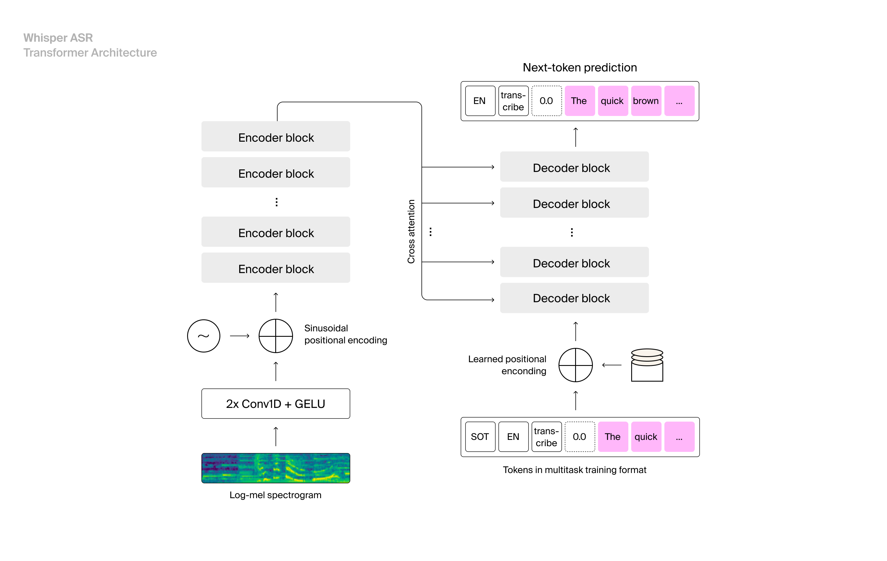

# Model infos

1. whisper-large-v2
Data train:  Trained on 680k hours of labelled data, The dataset also includes 125,000 hours of X→en translation data
Use Cases: Whisper-Large can be used for various speech recognition tasks, including transcription of audio recordings, voice commands, and speech-to-text translation
Architecture: 