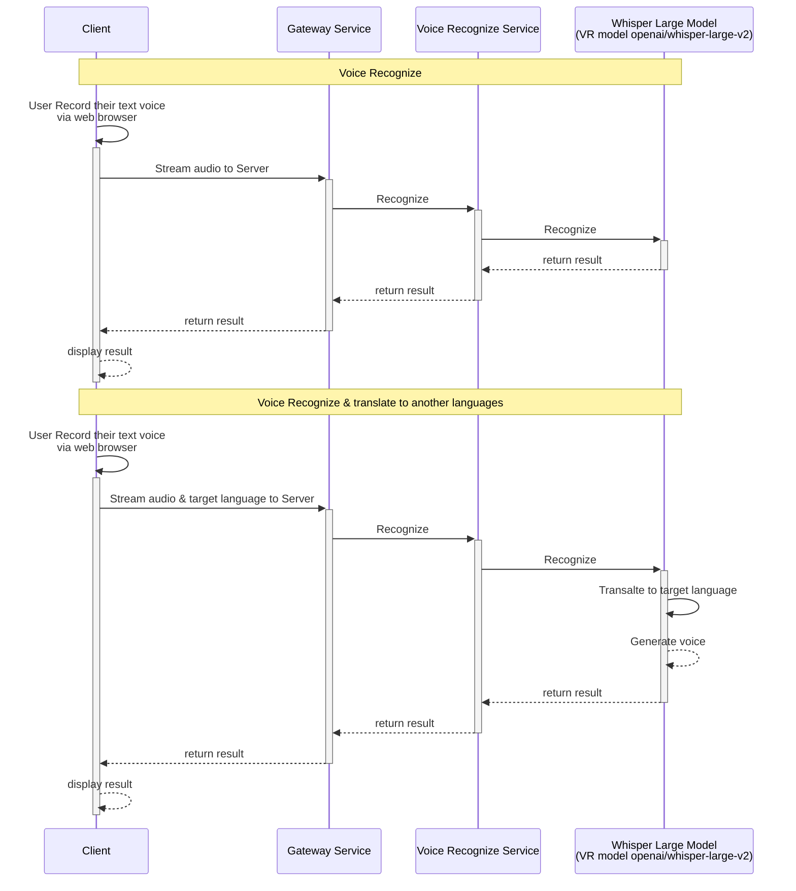
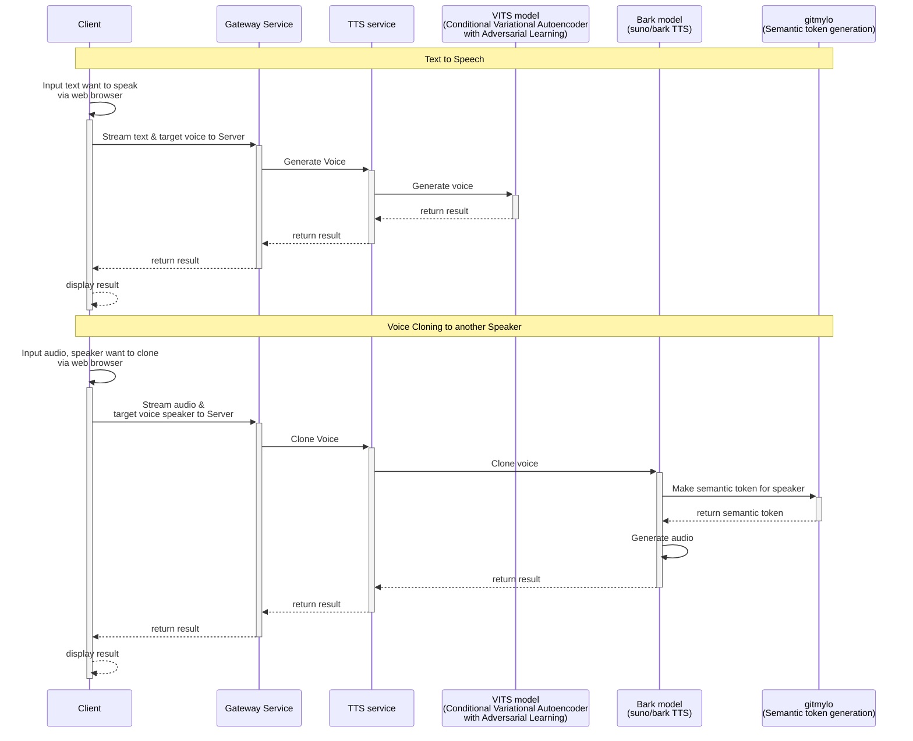
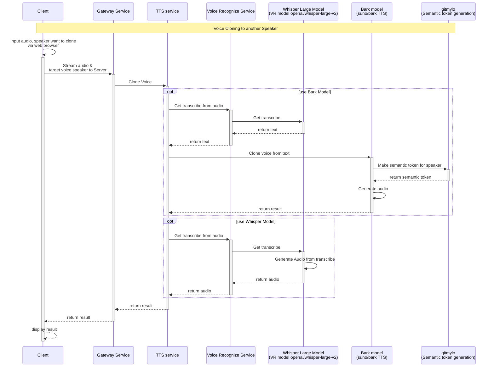

## Voice Recognize & Translate to another languages

```mermaid
sequenceDiagram
    participant c as Client
    participant g as Gateway Service
    participant v as Voice Recognize Service
    participant vm as Whisper Large Model  <br/> (VR model openai/whisper-large-v2)

    
    Note over c,vm: Voice Recognize 
    c ->>+c: User Record their text voice <br/> via web browser
    c ->>+g: Stream audio to Server
    g ->>+v: Recognize
    v ->>+vm: Recognize
    vm-->>-v: return result
    v-->>-g: return result
    g-->>-c: return result
    c-->>-c: display result

    Note over c,vm: Voice Recognize & translate to another languages
    c ->>+c: User Record their text voice <br/> via web browser
    c ->>+g: Stream audio & target language to Server
    g ->>+v: Recognize
    v ->>+vm: Recognize
    vm ->>vm: Transalte to target language
    vm-->>vm: Generate voice
    vm-->>-v: return result
    v-->>-g: return result
    g-->>-c: return result
    c-->>-c: display result

```

## Text To Speech

```mermaid
sequenceDiagram
    participant c as Client
    participant g as Gateway Service
    participant t as TTS service
    participant ttsm as VITS model <br/>(Conditional Variational Autoencoder <br/> with Adversarial Learning)
    participant vcm as Bark model <br/>(suno/bark TTS)
    participant gml as gitmylo   <br/>(Semantic token generation)
 

    Note over c,gml: Text to Speech
    c ->>+c: Input text want to speak <br/> via web browser
    c ->>+g: Stream text & target voice to Server
    g ->>+t: Generate Voice
    t ->>+ttsm: Generate voice
    ttsm-->>-t: return result
    t-->>-g: return result
    g-->>-c: return result
    c-->>-c: display result

    Note over c,gml: Voice Cloning to another Speaker
    c ->>+c: Input audio, speaker want to clone <br/> via web browser
    c ->>+g: Stream audio & <br/> target voice speaker to Server
    g ->>+t: Clone Voice
    t ->>+vcm: Clone voice
    vcm ->>+gml: Make semantic token for speaker
    gml-->>-vcm: return semantic token
    vcm ->>vcm: Generate audio
    vcm-->>-t: return result
    t-->>-g: return result
    g-->>-c: return result
    c-->>-c: display result
```

## Voice cloning

```mermaid
sequenceDiagram
    participant c as Client
    participant g as Gateway Service
    participant t as TTS service
    participant v as Voice Recognize Service
    participant vm as Whisper Large Model  <br/> (VR model openai/whisper-large-v2)
    participant vcm as Bark model <br/>(suno/bark TTS)
    participant gml as gitmylo   <br/>(Semantic token generation)
 


    Note over c,gml: Voice Cloning to another Speaker
    c ->>+c: Input audio, speaker want to clone <br/> via web browser
    c ->>+g: Stream audio & <br/> target voice speaker to Server
    g ->>+t: Clone Voice
    opt use Bark Model
        t ->>+v: Get transcribe from audio
        v ->>+vm: Get transcribe
        vm -->>-v: return text
        v-->>-t: return text
        t ->>+vcm: Clone voice from text
        vcm ->>+gml: Make semantic token for speaker
        gml-->>-vcm: return semantic token
        vcm ->>vcm: Generate audio
        vcm-->>-t: return result
    end

    opt use Whisper Model
        t ->>+v: Get transcribe from audio
        v ->>+vm: Get transcribe
        vm ->>vm: Generate Audio from transcribe
        vm -->>-v: return audio
        v-->>-t: return audio
    end
    t-->>-g: return result
    g-->>-c: return result
    c-->>-c: display result
```